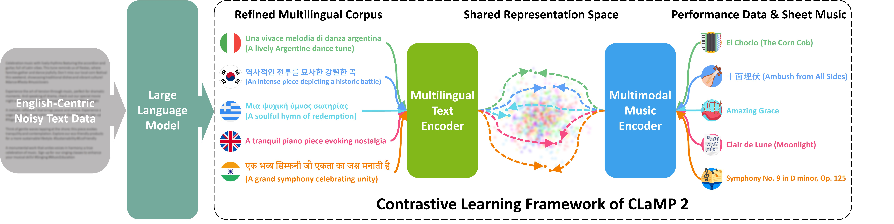

# CLaMP 2: Multimodal Music Information Retrieval Across 101 Languages Using Large Language Models



## Overview
CLaMP 2 is a music information retrieval model compatible with 101 languages, designed to support both ABC notation (a text-based musical notation format) and MIDI (Musical Instrument Digital Interface). This repository provides a comprehensive suite of scripts for training models, extracting features, converting various musical data formats, generating multilingual summaries of music metadata using GPT-4, and performing music classification and semantic search tasks. By leveraging the multilingual capabilities of GPT-4, CLaMP 2 aims to enhance the accuracy and inclusivity of music retrieval across diverse linguistic and musical modalities.

### Links
- [CLaMP 2 Code](https://github.com/sanderwood/clamp2)
- [CLaMP 2 Paper](https://arxiv.org/pdf/2410.13267)
- [CLaMP 2 Model Weights](https://huggingface.co/sander-wood/clamp2/blob/main/weights_clamp2_h_size_768_lr_5e-05_batch_128_scale_1_t_length_128_t_model_FacebookAI_xlm-roberta-base_t_dropout_True_m3_True.pth)
- [M3 Model Weights](https://huggingface.co/sander-wood/clamp2/blob/main/weights_m3_p_size_64_p_length_512_t_layers_3_p_layers_12_h_size_768_lr_0.0001_batch_16_mask_0.45.pth)

Note: The model weights for both CLaMP 2 and M3 should be placed under the `code/` folder to ensure proper loading. Make sure the config hyperparameters are correctly set.

## Repository Structure
The repository is organized into the following main directories:

- **`code/`**: Includes scripts for training the CLaMP 2 and M3 models and extracting features from music and text data. You can modify hyperparameters and file paths in the configuration files to suit your training needs.

- **`music_classification/`**: Contains scripts for performing classification tasks via linear probe using the extracted features. This directory includes utilities for training linear classification models and making predictions on new feature data.

- **`process_data/`**: Provides tools to convert between various musical data formats (ABC notation, MusicXML, MIDI, and MTF) and to summarize music metadata with GPT-4. Before using CLaMP 2 or M3, you should use these scripts to convert your files into interleaved ABC notation or MTF compatible with these models.
  
- **`semantic_search/`**: Provides scripts for evaluating model performance, conducting semantic searches, and calculating similarity metrics based on extracted feature vectors.

## Getting Started
### Environment Setup
To set up the environment for CLaMP 2, run the following commands:

```bash
conda env create -f environment.yml
conda activate clamp2
```

### Data Preparation
1. **Convert Files**: Navigate to the `process_data/` folder and convert your music files to a compatible format (interleaved ABC notation or MTF) suitable for CLaMP 2 and M3.
   - Use the conversion scripts in this folder for tasks like converting MusicXML to ABC and MIDI to MTF.

   - After collecting MusicXML (sheet music) or MIDI (performance data), perform the following operations to convert them into interleaved ABC notation or MTF respectively for model training:
      1. **Obtain Interleaved ABC Notation**:
         - Convert MusicXML files to ABC using `batch_xml2abc.py`.
         - Process the ABC files into interleaved notation using `batch_interleaved_abc.py`.
      2. **Obtain MTF**:
         - Convert MIDI files to MTF format using `batch_midi2mtf.py`.
      3. **Convert Interleaved ABC Back to XML (Optional)**:
         - Use `batch_xml2abc.py` to convert interleaved ABC files back to MusicXML.
      4. **Convert MTF Back to MIDI (Optional)**:
         - Use `batch_mtf2midi.py` to convert MTF files back to MIDI format.

2. **Generate Multilingual Metadata Summaries**: After converting the music files, the next step is to generate multilingual summaries of the music metadata. This is done using the `gpt4_summarize.py` script, which leverages the GPT-4 API to create structured summaries in both English and a randomly selected non-English language.

   **Input Example**: The input to the summarization script consists of a JSON file representing the music metadata. Here’s an example of a music entry in JSON format:

  ```json
  {
    "title": "Hard Times Come Again No More",
    "composer": "Stephen Foster",
    "genres": ["Children's Music", "Folk"],
    "description": "\"Hard Times Come Again No More\" (sometimes referred to as \"Hard Times\") is an American parlor song written by Stephen Foster, reflecting themes of sorrow and hope.",
    "lyrics": "Let us pause in life's pleasures and count its many tears,\nWhile we all sup sorrow with the poor;\nThere's a song that will linger forever in our ears;\nOh! Hard times come again no more.\n\nChorus:\n'Tis the song, the sigh of the weary,\nHard Times, hard times, come again no more.\nMany days you have lingered around my cabin door;\nOh! Hard times come again no more.\n\nWhile we seek mirth and beauty and music light and gay,\nThere are frail forms fainting at the door;\nThough their voices are silent, their pleading looks will say\nOh! Hard times come again no more.\nChorus\n\nThere's a pale weeping maiden who toils her life away,\nWith a worn heart whose better days are o'er:\nThough her voice would be merry, 'tis sighing all the day,\nOh! Hard times come again no more.\nChorus\n\n'Tis a sigh that is wafted across the troubled wave,\n'Tis a wail that is heard upon the shore\n'Tis a dirge that is murmured around the lowly grave\nOh! Hard times come again no more.\nChorus",
    "tags": ["folk", "traditional", "bluegrass", "nostalgic", "heartfelt", "acoustic", "melancholic", "storytelling", "American roots", "resilience"],
    "ensembles": ["Folk Ensemble"],
    "instruments": ["Vocal", "Violin", "Tin whistle", "Guitar", "Banjo", "Tambourine"],
    "filepaths": [
      "abc/American_Music/Folk_Traditions/19th_Century/Stephen_Foster/Hard_Times_Come_Again_No_More.abc",
      "mtf/American_Music/Folk_Traditions/19th_Century/Stephen_Foster/Hard_Times_Come_Again_No_More.mtf"
    ]
  }
  ```
   The filepaths field contains relative paths starting from the shortest common root directory (e.g., abc/ or mtf/). This ensures that only the minimal shared part of the path is included, and each file is represented with a concise relative path from this root.

   **Output Example**: The output will be a JSON file containing the structured summary in both English and a selected non-English language. Here’s an example of the expected output:

```json
{
  "title": "Hard Times Come Again No More",
  "composer": "Stephen Foster",
  "genres": ["Children's Music", "Folk"],
  "description": "\"Hard Times Come Again No More\" (sometimes referred to as \"Hard Times\") is an American parlor song written by Stephen Foster, reflecting themes of sorrow and hope.",
  "lyrics": "Let us pause in life's pleasures and count its many tears,\nWhile we all sup sorrow with the poor;\nThere's a song that will linger forever in our ears;\nOh! Hard times come again no more.\n\nChorus:\n'Tis the song, the sigh of the weary,\nHard Times, hard times, come again no more.\nMany days you have lingered around my cabin door;\nOh! Hard times come again no more.\n\nWhile we seek mirth and beauty and music light and gay,\nThere are frail forms fainting at the door;\nThough their voices are silent, their pleading looks will say\nOh! Hard times come again no more.\nChorus\n\nThere's a pale weeping maiden who toils her life away,\nWith a worn heart whose better days are o'er:\nThough her voice would be merry, 'tis sighing all the day,\nOh! Hard times come again no more.\nChorus\n\n'Tis a sigh that is wafted across the troubled wave,\n'Tis a wail that is heard upon the shore\n'Tis a dirge that is murmured around the lowly grave\nOh! Hard times come again no more.\nChorus",
  "tags": ["folk", "traditional", "bluegrass", "nostalgic", "heartfelt", "acoustic", "melancholic", "storytelling", "American roots", "resilience"],
  "ensembles": ["Folk Ensemble"],
  "instruments": ["Vocal", "Violin", "Tin whistle", "Guitar", "Banjo", "Tambourine"],
  "summary_en": "\"Hard Times Come Again No More,\" composed by Stephen Foster, is a poignant American parlor song that explores themes of sorrow and hope. The lyrics reflect on the contrast between life's pleasures and its hardships, inviting listeners to acknowledge both joy and suffering. With a heartfelt chorus that repeats the line \"Hard times come again no more,\" the song resonates with nostalgia and resilience. It is often performed by folk ensembles and features a variety of instruments, including vocals, violin, guitar, and banjo, encapsulating the spirit of American roots music.",
  "summary_nen": {
    "language": "Chinese (Simplified)",
    "summary": "《艰难时光再无来临》是斯蒂芬·福斯特创作的一首感人至深的美国小歌厅歌曲，探讨了悲伤与希望的主题。歌词展现了生活的乐趣与艰辛之间的对比，邀请听众去感受快乐与痛苦的交织。歌曲中那句反复吟唱的“艰难时光再无来临”深情地表达了怀旧与坚韧。它常常由民谣乐队演奏，伴随着人声、小提琴、吉他和班卓琴等多种乐器，生动地展现了美国根源音乐的独特魅力。"
  },
  "filepaths": [
    "abc/American_Music/Folk_Traditions/19th_Century/Stephen_Foster/Hard_Times_Come_Again_No_More.abc",
    "mtf/American_Music/Folk_Traditions/19th_Century/Stephen_Foster/Hard_Times_Come_Again_No_More.mtf"
  ]
}
```

After generating the individual JSON files:

1. Merge all JSON files into a single JSONL file.
 
2. Place the merged JSONL file and the shortest common root directories (e.g., abc/ and/or mtf/) in the same folder, structured like this:

```
/your-target-folder/
├── abc/
├── mtf/
├── merged_output.jsonl
```

### Training and Feature Extraction
2. **Training Models**: If you want to train CLaMP 2 or M3 models, check the scripts in the `code/` folder.
   - Modify the `config.py` files to set your training hyperparameters and paths.

3. **Extracting Features**: After training, or if you have pre-trained models, you can extract features from your data using the respective scripts in the `code/` folder.

### Classification and Retrieval
4. **Classification**: If you need to classify the extracted features, navigate to the `music_classification/` directory.
   - Here, you'll find scripts to train linear classification models and perform inference on new data.

5. **Semantic Search**: To perform semantic searches using the extracted features, refer to the scripts in the `semantic_search/` folder.

## Benchmarks
Benchmark datasets related to the experiments conducted with CLaMP 2 and M3, including data used for classification and semantic search tasks, are available in the `benchmarks.zip` file. Note that the `benchmarks.z01` file is required for proper extraction of the contents from `benchmarks.zip`.

## Citation

If you use CLaMP 2 or M3 in your research, please cite the following paper:

```bibtex
@misc{wu2024clamp2multimodalmusic,
      title={CLaMP 2: Multimodal Music Information Retrieval Across 101 Languages Using Large Language Models}, 
      author={Shangda Wu and Yashan Wang and Ruibin Yuan and Zhancheng Guo and Xu Tan and Ge Zhang and Monan Zhou and Jing Chen and Xuefeng Mu and Yuejie Gao and Yuanliang Dong and Jiafeng Liu and Xiaobing Li and Feng Yu and Maosong Sun},
      year={2024},
      eprint={2410.13267},
      archivePrefix={arXiv},
      primaryClass={cs.SD},
      url={https://arxiv.org/abs/2410.13267}, 
}
